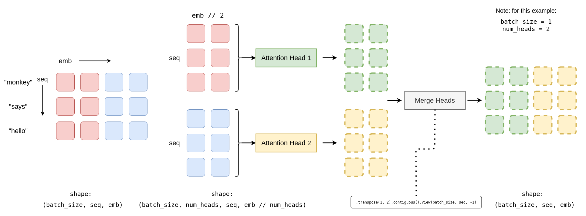

# tiny-transformer
tiny transformer(s) on pytorch

```python
import torch
from tiny_transformer import TinyTransformer

## contains both the encoder and the decoder
t = TinyTransformer(
    num_encoder_layers = 3,
    num_decoder_layers = 3,
    num_features = 512, 
    num_heads = 2, 
    dim_feedforward = 1024, 
    dropout = 0.1, 
    device= 'cpu'
)

x = torch.randn(1, 22, 512)
y = torch.randn(1, 22, 512)

out = t(x, y)
print(out.shape) ## should be (1, 22, 512)
```

## Why transformers ? 

The answer lies in the disadvantages we faced in the RNNs and the vanilla convnets:

* **RNNs**: For a given input sequence, we cannot compute the output for time step `i` until we've calculated the output for `i-1`.
* **ConvNets**: Only the words which are closer (i.e within the kernel size) together are able to interact which each other. This hinders long range interactions. 

The transformer is a solution to both the issues, it enables us to map long range interactions without any recurrent connections. 

## Key points to understand for newbies

### Attention

In simple words, Attention can be thought of a form of an approximation of a [SELECT](https://www.youtube.com/watch?t=707&v=OyFJWRnt_AY&feature=youtu.be) from a database.


### Multi Headed Attention



Let us imagine that we want to pass a tensor of shape `(batch_size, seq, emb)` through a multi-head attention layer. Where `seq` is the length of the sequence and `emb` is the embedding size of each element in the sequence.

In order to pass it through a multi head attention layer with (say) `n` heads, we split the tensor into `n` parts along the `emb` dim. This gives us `n` tensors of shape `(batch_size, seq, emb//n)`.

> Note that `emb` must be divisible by `n` for this to work.

We can then feed each of these tensors of shape `(batch_size, seq, emb//n)` into an attention head and then merge the results later on. 

But how does it help ? 

Since we are splitting the input along the embedding dimension, separate sections of the Embedding can learn different aspects of the meanings of each word/character/image patch.

### Position embeddings

When we feed an encoded form of an image/sentence into a transformer, it is also important for the model to "know" the position of each element in the sequence with respect to each other. This is where positional embeddings help. Generally, they're either added or concatenated into the input embedding vector before feeding it into the encoder/decoder blocks.


## Masked attention 


Masks serve to prevent the decoder from ‘peeking’ ahead at the rest of the target sentence when predicting the next word. The similarity scores of the "future" words are set to minus infinity so that they become zero after passing through the softmax layer. 

Note that masked attention is applied only to the first self-attention layer of the decoder. 


## The transformer's architecture


## Resources
- [Youtube video that explains transformers](https://www.youtube.com/watch?v=U0s0f995w14)
- [Blog post by peterbloem](http://peterbloem.nl/blog/transformers)
- [Medium Article, particularly useful if you want to understand multi head attention](https://towardsdatascience.com/transformers-explained-visually-part-3-multi-head-attention-deep-dive-1c1ff1024853)
